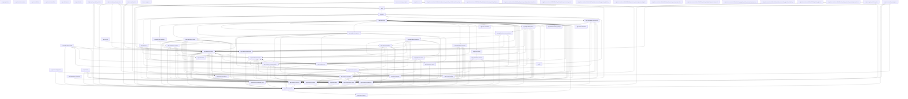

# Project Architecture

This diagram was automatically generated by `codebase-analyzer`.

```mermaid
graph TD
    app_application["app.application"]
    app_application_analytics["app.application.analytics"]
    app_application_content["app.application.content"]
    app_application_interaction["app.application.interaction"]
    app_application_linking["app.application.linking"]
    app_application_product["app.application.product"]
    app_application_recommendation["app.application.recommendation"]
    app_application_system["app.application.system"]
    app_application_taxonomy["app.application.taxonomy"]
    app_application_user["app.application.user"]
    app_core["app.core"]
    app_core_cli["app.core.cli"]
    app_core_context["app.core.context"]
    app_core_decorators["app.core.decorators"]
    app_core_extensions["app.core.extensions"]
    app_core_management["app.core.management"]
    app_domains["app.domains"]
    app_domains_analytics["app.domains.analytics"]
    app_domains_content["app.domains.content"]
    app_domains_distribution["app.domains.distribution"]
    app_domains_external["app.domains.external"]
    app_domains_interaction["app.domains.interaction"]
    app_domains_product["app.domains.product"]
    app_domains_recommendation["app.domains.recommendation"]
    app_domains_relationships["app.domains.relationships"]
    app_domains_serialization_utils["app.domains.serialization_utils"]
    app_domains_serializers["app.domains.serializers"]
    app_domains_shared_lookups["app.domains.shared_lookups"]
    app_domains_taxonomy["app.domains.taxonomy"]
    app_domains_user["app.domains.user"]
    app_infrastructure_cache["app.infrastructure.cache"]
    app_integrations_commercial["app.integrations.commercial"]
    app_integrations_content["app.integrations.content"]
    app_integrations_email["app.integrations.email"]
    app_integrations_scheduler["app.integrations.scheduler"]
    app_presentation_context["app.presentation.context"]
    app_shared_constants["app.shared.constants"]
    app_shared_decorators["app.shared.decorators"]
    app_shared_dto["app.shared.dto"]
    app_shared_filters["app.shared.filters"]
    app_shared_normalizer["app.shared.normalizer"]
    app_shared_parsing["app.shared.parsing"]
    app_shared_request["app.shared.request"]
    app_shared_sanitizer["app.shared.sanitizer"]
    app_shared_utils["app.shared.utils"]
    app_shared_validators["app.shared.validators"]
    app_web_helpers["app.web.helpers"]
    app_web_routes["app.web.routes"]
    app_web_static["app.web.static"]
    config["config"]
    helpers_analyze_data_structure["helpers.analyze_data_structure"]
    helpers_print_multiple_authors["helpers.print_multiple_authors"]
    helpers_profile_data["helpers.profile_data"]
    helpers_proj_tree["helpers.proj_tree"]
    helpers_taxonomy_analysis["helpers.taxonomy_analysis"]
    main["main"]
    migrations_env["migrations.env"]
    migrations_versions_0a3a9baa1c62_remove_provider_confidence_from_entity["migrations.versions.0a3a9baa1c62_remove_provider_confidence_from_entity"]
    migrations_versions_125d7ddee917_added_enrichment_priority_field_to_["migrations.versions.125d7ddee917_added_enrichment_priority_field_to_"]
    migrations_versions_4fc1a7bffe28_add_author_model_and_article_authors["migrations.versions.4fc1a7bffe28_add_author_model_and_article_authors"]
    migrations_versions_70235d590eb7_added_video_comments_model["migrations.versions.70235d590eb7_added_video_comments_model"]
    migrations_versions_8f1e4c19d675_add_commercial_ingestion_pipeline_["migrations.versions.8f1e4c19d675_add_commercial_ingestion_pipeline_"]
    migrations_versions_a83bf5d2c009_increase_taxonomy_name_lengths["migrations.versions.a83bf5d2c009_increase_taxonomy_name_lengths"]
    migrations_versions_a88bca3074a3_add_country_name_to_location["migrations.versions.a88bca3074a3_add_country_name_to_location"]
    migrations_versions_b6ec708c58da_added_body_field_to_article_model["migrations.versions.b6ec708c58da_added_body_field_to_article_model"]
    migrations_versions_b7d9ae6de61a_upgrade_article_categories_to_store_["migrations.versions.b7d9ae6de61a_upgrade_article_categories_to_store_"]
    migrations_versions_cffe9cd40bfc_add_commercial_ingestion_pipeline_["migrations.versions.cffe9cd40bfc_add_commercial_ingestion_pipeline_"]
    migrations_versions_d692a73729af_initial_migration["migrations.versions.d692a73729af_initial_migration"]
    migrations_versions_e99fd08cc44e_drop_external_uri_and_json_authors["migrations.versions.e99fd08cc44e_drop_external_uri_and_json_authors"]
    scripts_migrate_authors_data["scripts.migrate_authors_data"]
    scripts_normalize_categories["scripts.normalize_categories"]
    scripts_seed["scripts.seed"]

    app_application_analytics --> app_domains_analytics
    app_application_analytics --> app_infrastructure_cache
    app_application_content --> app_core_extensions
    app_application_content --> app_domains_content
    app_application_content --> app_domains_distribution
    app_application_content --> app_domains_interaction
    app_application_content --> app_domains_recommendation
    app_application_content --> app_domains_serializers
    app_application_content --> app_domains_taxonomy
    app_application_content --> app_infrastructure_cache
    app_application_content --> app_integrations_content
    app_application_content --> app_shared_constants
    app_application_content --> app_shared_dto
    app_application_content --> app_shared_utils
    app_application_interaction --> app_application_user
    app_application_interaction --> app_core_extensions
    app_application_interaction --> app_domains_analytics
    app_application_interaction --> app_domains_content
    app_application_interaction --> app_domains_interaction
    app_application_interaction --> app_domains_product
    app_application_interaction --> app_domains_recommendation
    app_application_interaction --> app_domains_user
    app_application_interaction --> app_shared_constants
    app_application_linking --> app_core_extensions
    app_application_linking --> app_domains_content
    app_application_linking --> app_domains_product
    app_application_linking --> app_domains_recommendation
    app_application_linking --> app_domains_relationships
    app_application_product --> app_application_recommendation
    app_application_product --> app_core_extensions
    app_application_product --> app_domains_distribution
    app_application_product --> app_domains_interaction
    app_application_product --> app_domains_product
    app_application_product --> app_domains_recommendation
    app_application_product --> app_domains_taxonomy
    app_application_product --> app_infrastructure_cache
    app_application_product --> app_shared_constants
    app_application_product --> app_shared_utils
    app_application_recommendation --> app_application_interaction
    app_application_recommendation --> app_core_extensions
    app_application_recommendation --> app_domains_content
    app_application_recommendation --> app_domains_product
    app_application_recommendation --> app_domains_recommendation
    app_application_system --> app_application_content
    app_application_system --> app_domains_content
    app_application_system --> app_domains_product
    app_application_system --> app_domains_recommendation
    app_application_system --> app_domains_taxonomy
    app_application_system --> app_domains_user
    app_application_system --> app_infrastructure_cache
    app_application_system --> app_integrations_email
    app_application_taxonomy --> app_core_extensions
    app_application_taxonomy --> app_domains_content
    app_application_taxonomy --> app_domains_external
    app_application_taxonomy --> app_domains_relationships
    app_application_taxonomy --> app_domains_taxonomy
    app_application_taxonomy --> app_shared_utils
    app_application_user --> app_application_interaction
    app_application_user --> app_core_extensions
    app_application_user --> app_domains_taxonomy
    app_application_user --> app_domains_user
    app_application_user --> app_integrations_email
    app_application_user --> app_shared_utils
    app_core --> app_core_extensions
    app_core --> app_domains
    app_core --> app_domains_user
    app_core --> app_integrations_commercial
    app_core --> app_web_routes
    app_core --> config
    app_core_cli --> app_integrations_content
    app_core_context --> app_presentation_context
    app_core_extensions --> app_shared_request
    app_core_management --> app_core_extensions
    app_core_management --> app_domains_taxonomy
    app_domains --> app_domains_content
    app_domains --> app_domains_distribution
    app_domains --> app_domains_external
    app_domains --> app_domains_interaction
    app_domains --> app_domains_product
    app_domains --> app_domains_recommendation
    app_domains --> app_domains_relationships
    app_domains --> app_domains_taxonomy
    app_domains --> app_domains_user
    app_domains_analytics --> app_core_extensions
    app_domains_analytics --> app_domains_content
    app_domains_analytics --> app_domains_distribution
    app_domains_analytics --> app_domains_interaction
    app_domains_analytics --> app_domains_product
    app_domains_analytics --> app_domains_relationships
    app_domains_analytics --> app_domains_taxonomy
    app_domains_analytics --> app_domains_user
    app_domains_content --> app_core_extensions
    app_domains_content --> app_domains_interaction
    app_domains_content --> app_domains_relationships
    app_domains_content --> app_domains_serialization_utils
    app_domains_content --> app_domains_serializers
    app_domains_content --> app_domains_taxonomy
    app_domains_content --> app_infrastructure_cache
    app_domains_content --> app_shared_constants
    app_domains_content --> app_shared_dto
    app_domains_content --> app_shared_sanitizer
    app_domains_content --> app_shared_utils
    app_domains_distribution --> app_core_extensions
    app_domains_external --> app_core_extensions
    app_domains_interaction --> app_core_extensions
    app_domains_interaction --> app_domains_content
    app_domains_interaction --> app_domains_product
    app_domains_interaction --> app_domains_recommendation
    app_domains_interaction --> app_domains_user
    app_domains_interaction --> app_shared_constants
    app_domains_interaction --> app_shared_utils
    app_domains_product --> app_core_extensions
    app_domains_product --> app_domains_interaction
    app_domains_product --> app_domains_relationships
    app_domains_product --> app_domains_serialization_utils
    app_domains_product --> app_domains_serializers
    app_domains_product --> app_domains_taxonomy
    app_domains_product --> app_infrastructure_cache
    app_domains_product --> app_shared_parsing
    app_domains_product --> app_shared_sanitizer
    app_domains_recommendation --> app_core_extensions
    app_domains_recommendation --> app_domains_content
    app_domains_recommendation --> app_domains_interaction
    app_domains_recommendation --> app_domains_product
    app_domains_recommendation --> app_domains_relationships
    app_domains_recommendation --> app_infrastructure_cache
    app_domains_recommendation --> app_shared_constants
    app_domains_relationships --> app_core_extensions
    app_domains_serializers --> app_domains_serialization_utils
    app_domains_taxonomy --> app_core_extensions
    app_domains_taxonomy --> app_domains_content
    app_domains_taxonomy --> app_domains_external
    app_domains_taxonomy --> app_domains_product
    app_domains_taxonomy --> app_domains_relationships
    app_domains_taxonomy --> app_infrastructure_cache
    app_domains_taxonomy --> app_shared_utils
    app_domains_user --> app_core_extensions
    app_domains_user --> app_domains_interaction
    app_domains_user --> app_shared_utils
    app_infrastructure_cache --> app_core_extensions
    app_integrations_commercial --> app_application_product
    app_integrations_commercial --> app_core
    app_integrations_commercial --> app_core_extensions
    app_integrations_commercial --> app_domains_product
    app_integrations_commercial --> app_domains_taxonomy
    app_integrations_commercial --> app_shared_sanitizer
    app_integrations_commercial --> app_shared_utils
    app_integrations_content --> app_application_content
    app_integrations_content --> app_core_extensions
    app_integrations_content --> app_domains_content
    app_integrations_content --> app_domains_external
    app_integrations_content --> app_shared_constants
    app_integrations_content --> app_shared_dto
    app_integrations_content --> app_shared_utils
    app_integrations_email --> app_core_extensions
    app_integrations_scheduler --> app_shared_utils
    app_presentation_context --> app_core_extensions
    app_presentation_context --> app_domains_taxonomy
    app_presentation_context --> app_domains_user
    app_presentation_context --> app_infrastructure_cache
    app_presentation_context --> config
    app_shared_parsing --> app_domains_interaction
    app_shared_parsing --> app_shared_constants
    app_shared_utils --> app_core_extensions
    app_web_routes --> app_application_analytics
    app_web_routes --> app_application_content
    app_web_routes --> app_application_interaction
    app_web_routes --> app_application_product
    app_web_routes --> app_application_recommendation
    app_web_routes --> app_application_system
    app_web_routes --> app_application_taxonomy
    app_web_routes --> app_application_user
    app_web_routes --> app_core_context
    app_web_routes --> app_core_decorators
    app_web_routes --> app_core_extensions
    app_web_routes --> app_domains_analytics
    app_web_routes --> app_domains_content
    app_web_routes --> app_domains_external
    app_web_routes --> app_domains_interaction
    app_web_routes --> app_domains_product
    app_web_routes --> app_domains_recommendation
    app_web_routes --> app_domains_relationships
    app_web_routes --> app_domains_shared_lookups
    app_web_routes --> app_domains_taxonomy
    app_web_routes --> app_domains_user
    app_web_routes --> app_infrastructure_cache
    app_web_routes --> app_shared_constants
    app_web_routes --> app_shared_parsing
    app_web_routes --> app_shared_request
    app_web_routes --> app_shared_sanitizer
    app_web_routes --> app_shared_utils
    app_web_routes --> app_shared_validators
    helpers_analyze_data_structure --> app_core_extensions
    helpers_analyze_data_structure --> app_domains_content
    helpers_analyze_data_structure --> app_domains_taxonomy
    helpers_analyze_data_structure --> main
    helpers_print_multiple_authors --> app_core_extensions
    helpers_print_multiple_authors --> app_domains_content
    helpers_print_multiple_authors --> main
    helpers_profile_data --> app_core_extensions
    helpers_profile_data --> app_domains_content
    helpers_profile_data --> app_domains_taxonomy
    helpers_profile_data --> main
    helpers_taxonomy_analysis --> app_core_extensions
    helpers_taxonomy_analysis --> app_domains_content
    helpers_taxonomy_analysis --> app_domains_relationships
    helpers_taxonomy_analysis --> app_domains_taxonomy
    helpers_taxonomy_analysis --> main
    main --> app_core
    scripts_migrate_authors_data --> app_core_extensions
    scripts_migrate_authors_data --> app_domains_content
    scripts_migrate_authors_data --> app_domains_relationships
    scripts_migrate_authors_data --> main
    scripts_normalize_categories --> app_core_extensions
    scripts_normalize_categories --> app_domains_relationships
    scripts_normalize_categories --> app_domains_taxonomy
    scripts_normalize_categories --> main
    scripts_seed --> app_core_extensions
    scripts_seed --> app_domains_taxonomy
    scripts_seed --> app_shared_constants
    scripts_seed --> app_shared_utils
```
